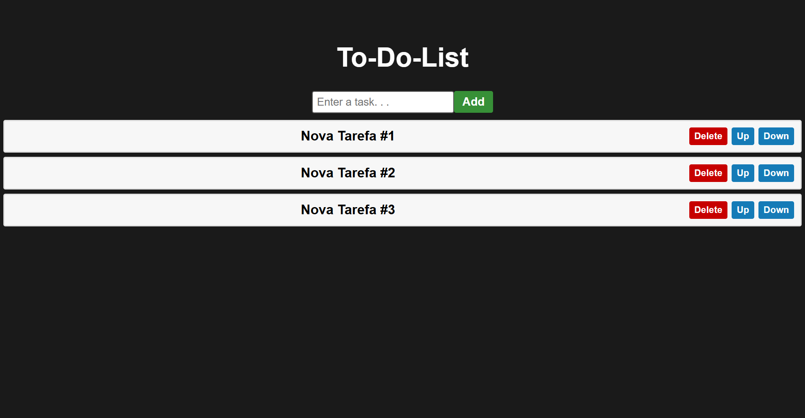

# 📝 To-Do List

Uma aplicação de lista de tarefas desenvolvida com **React** e **Vite**, feito para treinar alguns conceitos.

---

## 🚀 Tecnologias utilizadas

- [React](https://reactjs.org/)
- [Vite](https://vitejs.dev/)
- [JavaScript](https://developer.mozilla.org/pt-BR/docs/Web/JavaScript)
- [CSS](https://developer.mozilla.org/pt-BR/docs/Web/CSS)

---

## 📸 Preview



---

## ⚙️ Como executar o projeto

1. Clone o repositório:

```bash
git clone https://github.com/IsaacTeles-cmd/To-Do-List.git
